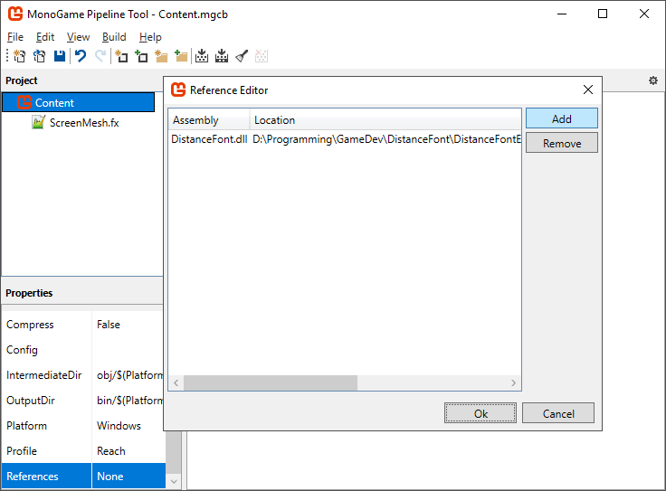
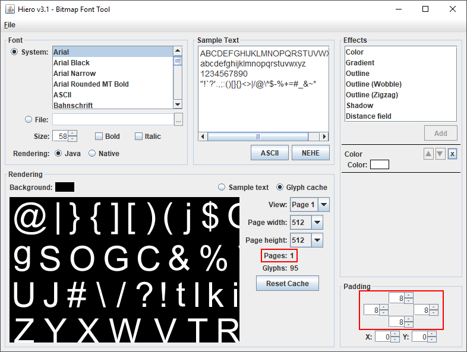
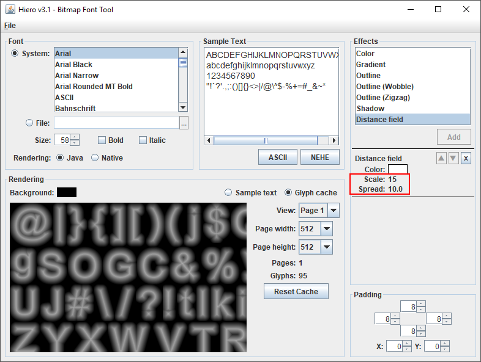

# Monogame Distance Font Documentation

## Importing fonts
You can copy the font files used in the example project font a quick start. Make sure to copy both the `.fnt` and the `.png` file to your project's Content folder.

### Using a content pipeline extension


Open your Content file, and in the Project panel click Content (should be the top-most element). In the properties window, scroll down and click on the References property. Add `DistanceFont.dll` to the list of references. Now you can add and build `.fnt` files. You must also include `ScreenMesh.fx` from DistanceFieldExample project.

### Loading content
Make sure your Monogame project has `DistanceField.dll` added as a reference. Enable shader support by setting `graphics.GraphicsProfile` to `HiDef`, and initialize the font renderer and load a font in your LoadContent method:

```C#
public Game1()
{
    ...
    
    //Enable shader support
    graphics.GraphicsProfile = GraphicsProfile.HiDef;
}

protected override void LoadContent()
{
    Font.Initialize(Content.Load<Effect>("ScreenMesh"));
    Font.OnResize(Window.ClientBounds.Width, Window.ClientBounds.Height);

    Font font = Content.Load<Font>("Arial");
}
```

If you have a resizable window or you allow fullscreen toggling, you need to inform the font renderer of the window size changes unless you want the text to stretch.

```C#
public Game1()
{
    ...
    
    //Enable shader support
    graphics.GraphicsProfile = GraphicsProfile.HiDef;
    
    //Allow window resizing and set resize callback
    Window.ClientSizeChanged += (sender, e) => OnResize(Window.ClientBounds.Width, Window.ClientBounds.Height);
    Window.AllowUserResizing = true;
}

private void OnResize(int width, int height)
{
    Font.OnResize(width, height);
}

protected override void LoadContent()
{
    Font.Initialize(Content.Load<Effect>("ScreenMesh"));
    OnResize(Window.ClientBounds.Width, Window.ClientBounds.Height);
    
    Font font = Content.Load<Font>("Arial");
}
```

___

## Creating fonts
We will be using Hiero to generate a high quality distance field texture. Hiero is a part of the LibGDX project. For some odd reason, the newer versions of Hiero don't come with the Distance Field effect included so an older version of the application is required.

### Installing Hiero
Download `libgdx-1.6.1.zip` from [an older releases archive](https://libgdx.badlogicgames.com/old-site/releases/) (it's at the bottom) and extract it. Run Hiero using the following command:

    java -cp gdx.jar;gdx-natives.jar;gdx-backend-lwjgl.jar;gdx-backend-lwjgl-natives.jar;extensions\gdx-freetype\gdx-freetype.jar;extensions\gdx-freetype\gdx-freetype-natives.jar;extensions\gdx-tools\gdx-tools.jar com.badlogic.gdx.tools.hiero.Hiero

I recommend saving the command as a batch file, for easier use later. 

### Using Hiero
 | 
:-------------------------:|:-------------------------:

1. Select a font and set padding to 8 in all directions.
2. Tick "Glyph cache" radio button and increase font size as much as possible, while making sure the number of pages stays one.
3. Click the X next to `Color` at the Effects panel.
4. Select `Distance Field` effect and click Add.
5. Set `Spread` to `10` and `Scale` to `15`. Calculating the improved texture takes a couple seconds.
6. `File` -> `Save BMFont files (text)...`

Save it to your Monogame Content folder and import the `.fnt` file into your Content file. You don't need to import the generated `.png` file, just make sure it's located in the same folder with the `.fnt` file.

If you're creating multiple fonts in one go remove the `Distance Field` effect and add the `Color` effect back when changing fonts and looking for the largest available font size to speed-up the process.
