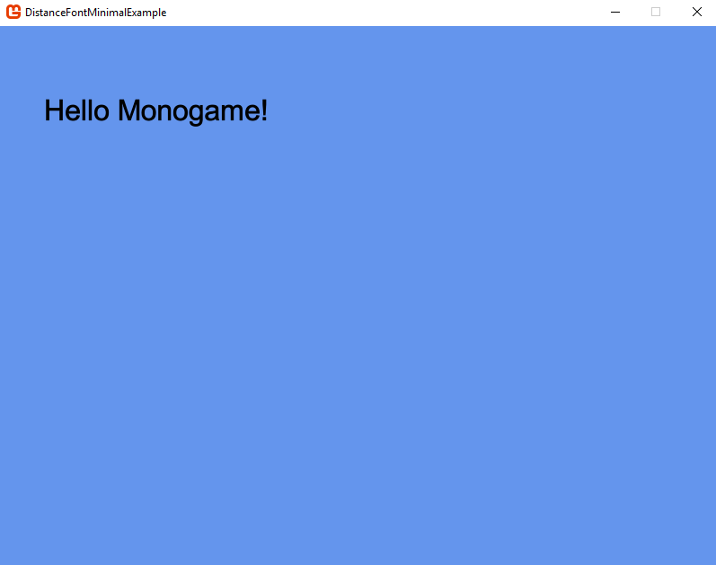
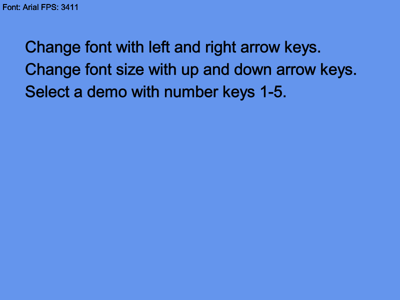
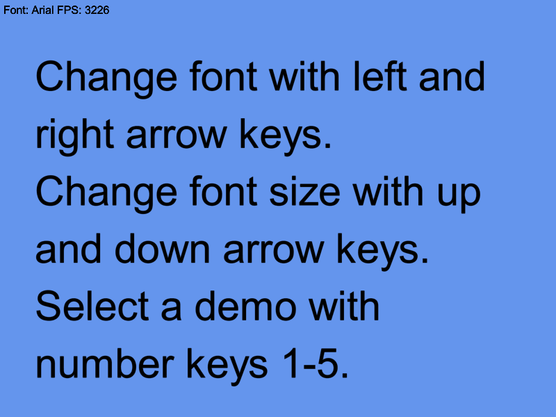

## A simple signed distance field font renderer for Monogame


### [Documentation](./documentation.md)
Detailed information on usage and creating your own fonts.

### Features
* Works like a sprite font
* Scaling without losing quality
* Great performance
* Outline and glow
* Kerning and text boxes

Distance field fonts are very similar to sprite fonts. Both are drawn using a single textured quad per character. A distance field image is used instead of a texture to keep quality high even when scaled. Using distance fields should feel familiar, there's no extra hoops to jump through -- no need to render to a texture first or anything.

Scaled down                |  Scaled up
:-------------------------:|:-------------------------:
 | 

### Usage
Add `DistanceField.dll` as a reference to Monogame pipeline tool, and to your Monogame project. Import a BMFont file with the pipeline tool and load it like any other resource. The BMFont file should be in the same folder with a distance field image that has the same file name.

```C#
//Load like any other pipeline resource
Font font = Content.Load<Font>("Arial");

...

//Draw text
font.DrawString("Hello Monogame!", Color.Black, new Vector2(20, 20), 12);
```

For more detailed information on usage, please see the [documentation](./documentation.md).

### Future plans
Instead of importing BMFont files and distance field images generated by an external tool, it would be great to able to import a TrueType/OpenType file and have the importer generate a distance field image and required metadata. This would make the project truly standalone. However getting that to work is quite involved.

The steps needed to create this type of importer:
* Loading glyph outlines from a .ttf/.otf file.
* Being able to actually render characters.
* Finding a font size that allows all characters to fit using square packing.
* Generating a distance field. Has to be done at a higher quality then scaled down.

Parsing font files and rendering glyphs can be outsourced to a library, but I have not been able to find a font library that does high quality distance field rendering as well.
